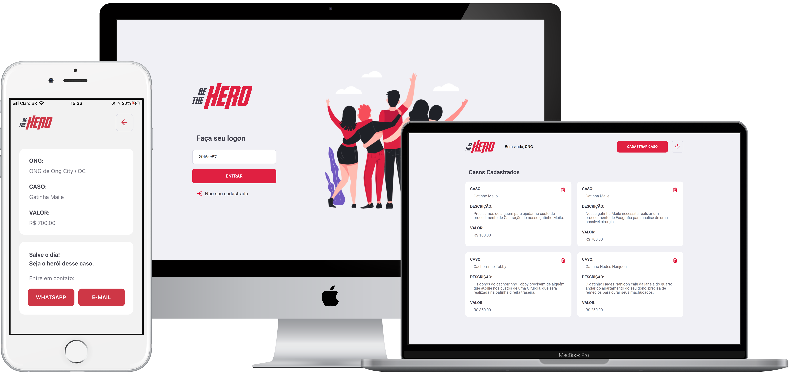

___

    

     

    
    
        
    
    
        
        

     

    <a href="#dart-sobre">Sobre</a>&nbsp;&nbsp;&nbsp;|&nbsp;&nbsp;&nbsp;
    <a href="#battery-tecnologias">Tecnologias</a>&nbsp;&nbsp;&nbsp;|&nbsp;&nbsp;&nbsp;
    <a href="#electric_plug-execute">Execute</a>&nbsp;&nbsp;&nbsp;|&nbsp;&nbsp;&nbsp;
    <a href="#fuelpump-autor">Autor</a>&nbsp;&nbsp;&nbsp;|&nbsp;&nbsp;&nbsp;
    <a href="#memo-licença">Licença</a>

     

  

## :dart: Sobre

A **BeTheHero** é uma Aplicação que visa conectar pessoas que desejam fazer contribuições monetárias a ONGs *(Organizações Não Governamentais)* que precisam de ajuda.

## :battery: Tecnologias
Essa Aplicação foi desenvolvida utilizando as seguintes tecnologias:

- <a href="https://insomnia.rest/">Insomnia</a>
- <a href="https://sqlite.org/">SQLite 3</a>
- <a href="https://knexjs.org/">KnexJS</a>
- <a href="https://nodejs.org/">NodeJS</a>
- <a href="https://reactjs.org/">ReactJS</a>
- <a href="https://axios-http.com/">Axios</a>
- <a href="https://expo.dev/">Expo IO</a>
- <a href="https://reactnative.dev/">React Native</a>

## :fuelpump: Autor

Projeto desenvolvido durante a **Semana OmniStack 11** da <a href="https://rocketseat.com.br/">Rocketseat</a>, ocorrida em **Março de 2020**;

Acesse <a href="https://github.com/rocketseat-education/semana-omnistack-11">aqui</a> o **repositório oficial** da aplicação.

## :memo: Licença

Esse projeto está sob a **Licença MIT**. Veja o arquivo [LICENSE](https://github.com/alissonpratesperes/bethehero/blob/main/LICENSE) para mais detalhes.

___

<h5 align="center">👨🏻‍💻&nbsp;com&nbsp;💜&nbsp;por&nbsp;<a href="https://github.com/alissonpratesperes">Alisson Prates Peres</a>&nbsp;✌🏻😗</h5>