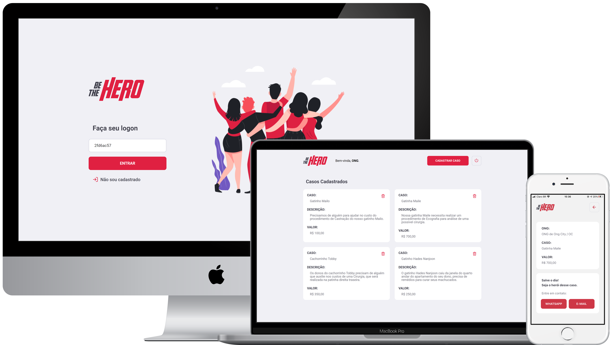

  

___

 

  <a href="#sobre">SOBRE</a>&nbsp;&nbsp;&nbsp;|&nbsp;&nbsp;&nbsp;<a href="#tecnologia">TECNOLOGIA</a>&nbsp;&nbsp;&nbsp;|&nbsp;&nbsp;&nbsp;<a href="#execute">EXECUTE</a>&nbsp;&nbsp;&nbsp;|&nbsp;&nbsp;&nbsp;<a href="#autor">AUTOR</a>&nbsp;&nbsp;&nbsp;|&nbsp;&nbsp;&nbsp;<a href="#licença">LICENÇA</a>

 

  

## SOBRE

A **bethehero** é uma Aplicação que visa conectar Pessoas que desejam fazer Contribuições Monetárias a ONGs *(Organizações Não Governamentais)* que precisam de ajuda em suas causas

## TECNOLOGIA

TOOLING | <a href="https://insomnia.rest/">Insomnia</a> • <a href="https://expo.dev/">Expo IO</a>

DATABASE | <a href="https://sqlite.org/">SQLite 3</a> • <a href="https://knexjs.org/">KnexJS</a>

INTEGRATION | <a href="https://expressjs.com/">Express</a> • <a href="https://axios-http.com/">Axios</a>

BACK-END | <a href="https://nodejs.org/">NodeJS</a>

FRONT-END | <a href="https://reactjs.org/">ReactJS</a>

MOBILE | <a href="https://reactnative.dev/">React Native</a>

## EXECUTE

    - Clonar o Repositório
    - Acessar o Back-End: "./backend"
        |- Instalar as dependências com o Comando: "npm install --force"
            >_ Inicializar o Back-End com o Comando: "npm start"
    - Acessar o Front-End: "./frontend"
        |- Instalar as dependências com o Comando: "npm install --force"
        |- Acessar o arquivo: "./frontend/src/services/api.js:3" e atualizar o Endereço de Conexão do Front-End
            >_ Inicializar o Front-End com o Comando: "npm start"
    - Acessar o Mobile: "./mobile"
        |- Instalar as dependências com o Comando: "npm install --force"
        |- Acessar o arquivo: "./mobile/src/services/api.js:3" e atualizar o Endereço de Conexão do Mobile
            >_ Inicializar o Mobile com o Comando: "expo start"

## AUTOR

Projeto desenvolvido durante a **Omni Stack Week 11** da <a href="https://rocketseat.com.br/">Rocketseat</a> ocorrida em **Março de 2020**

Acesse <a href="https://github.com/rocketseat-education/semana-omnistack-11">aqui</a> o **repositório oficial** do Projeto

## LICENÇA

Esse projeto está sob a **Licença MIT** veja o arquivo [LICENSE](https://github.com/alissonpratesperes/bethehero/blob/main/LICENSE) para mais detalhes

___

✍🏻&nbsp;with&nbsp;❤️&nbsp;by&nbsp;<a href="https://github.com/alissonpratesperes">me</a>&nbsp👨🏻‍💻
